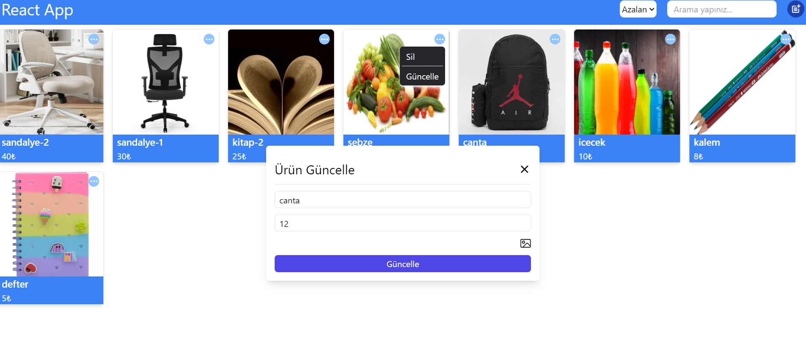
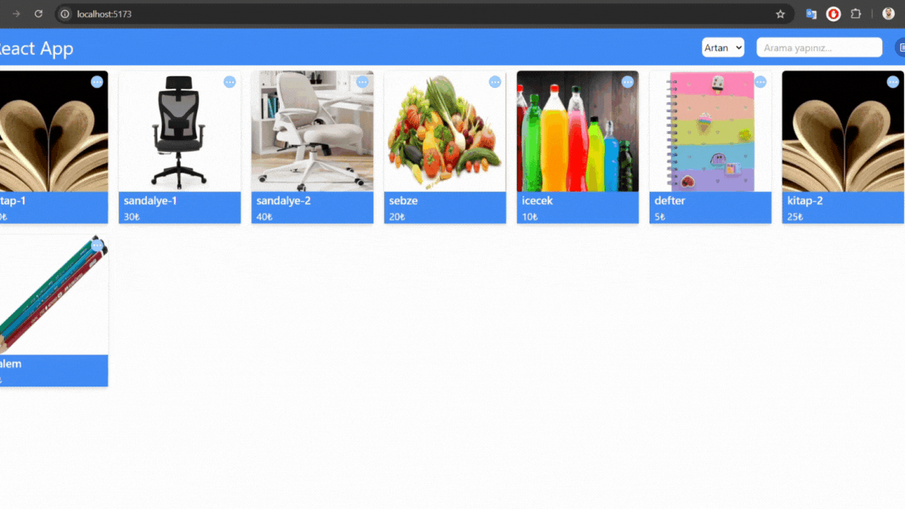

# React_Redux_App

This project utilizes Redux for state management and allows users to create, add, remove, update, and delete products. Users can also sort products in ascending or descending order and search for specific items.

# Libraries

@reduxjs/toolkit
react-icons
react-redux
react-router-dom

# Screenshots

## Gif

